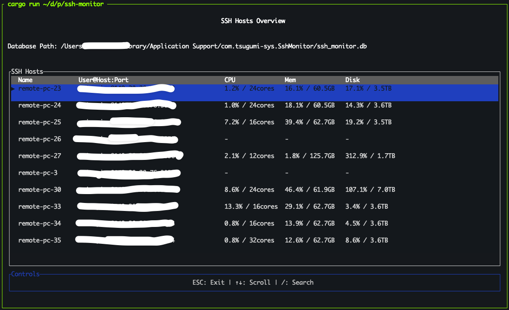
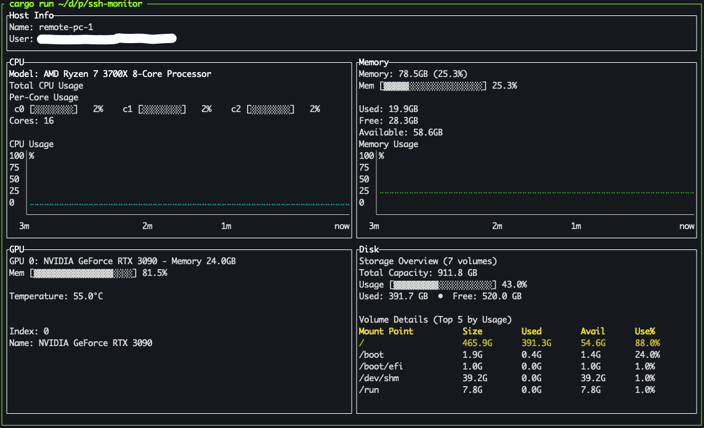

# SSH Monitor

A terminal-based SSH monitoring tool that provides real-time system metrics visualization for remote hosts. Built with [Ratatui] for an interactive terminal user interface.

## Features

- Automatically discovers SSH hosts from your SSH config
- Monitor system metrics including:
  - CPU usage and timeline
  - Memory utilization
  - Disk usage
  - GPU metrics (if available)

## Screenshots

### Host List View
The main interface showing all discovered SSH hosts with their current system metrics:



### Detailed Host View  
Comprehensive system monitoring with timeline charts for CPU, memory, GPU, and disk usage:




### SSH Configuration

The application reads SSH hosts from your SSH config file (typically `~/.ssh/config`). Ensure your hosts are properly configured with connection details.

Example SSH config entry:
```
Host myserver
    HostName 192.168.1.100
    User username
    Port 22
```

## Setup

### 1. SSH Agent Setup

Start SSH Agent:

```bash
# Start ssh-agent (if not already running)
eval "$(ssh-agent -s)"
```

Add SSH Keys:

```bash
# Add your private key to ssh-agent
ssh-add ~/.ssh/id_rsa

# Or add a specific key
ssh-add ~/.ssh/your_private_key

# Verify keys are loaded
ssh-add -l
```


### 2. Installation


## Development

For development information including architecture, testing, and contribution guidelines, see [docs/DEVELOPMENT.md](docs/DEVELOPMENT.md).

## License

Copyright (c) Akira Noda <tidemark0105@gmail.com>

This project is licensed under the MIT license ([LICENSE] or <http://opensource.org/licenses/MIT>)

[LICENSE]: ./LICENSE
